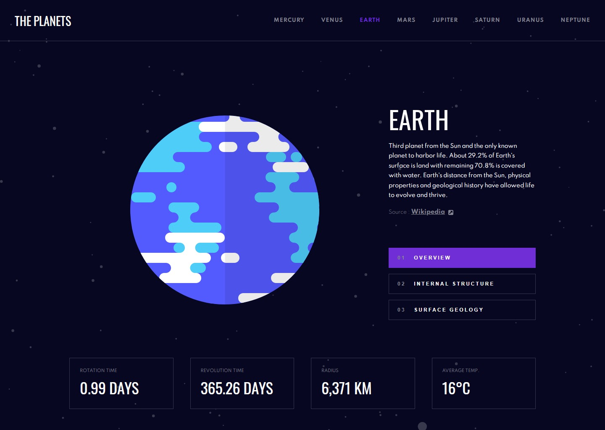

# Frontend Mentor - Planets fact site solution

This is a solution to the Planets fact site challenge on Frontend Mentor. Frontend Mentor challenges help you improve your coding skills by building realistic projects.

## Table of Contents

- [Overview](#overview)
  - [The challenge](#the-challenge)
  - [Screenshot](#screenshot)
  - [Links](#links)
- [My process](#my-process)
  - [Built with](#built-with)
  - [What I learned / practised](#what-i-learned)
  - [Continued development](#continued-development)
  - [Useful resources](#useful-resources)
- [Author](#author)
- [Acknowledgments](#acknowledgments)

## Overview

### The challenge

Users should be able to:

- View the optimal layout for the app depending on their device's screen size
- See hover states for all interactive elements on the page
- View each planet page and toggle between "Overview", "Internal Structure", and "Surface Geology"

### Screenshot

### Links

- [Live Site URL](https://planets-fact-terejko.netlify.app)

### Built with

- [Styled Components](https://styled-components.com/) - For styles
- [Framer Motion](https://www.framer.com/motion/) - For animations
- [React Router](https://reactrouter.com/) - For Routes
- CSS custom properties

### What I learned / practised

- React
- React Router
- Framer Motion

### Useful resources

- The Net Ninja Framer Motion (for React) Tutorial [YouTube](https://www.youtube.com/playlist?list=PL4cUxeGkcC9iHDnQfTHEVVceOEBsOf07i)
- The Net Ninja Full Modern React Tutorial [YouTube](https://www.youtube.com/playlist?list=PL4cUxeGkcC9gZD-Tvwfod2gaISzfRiP9d)

## Author

- Website - [My Website](https://terejkodev.netlify.app)

## Acknowledgments

- Thank you to the Frontendmentor.io for provading this project
